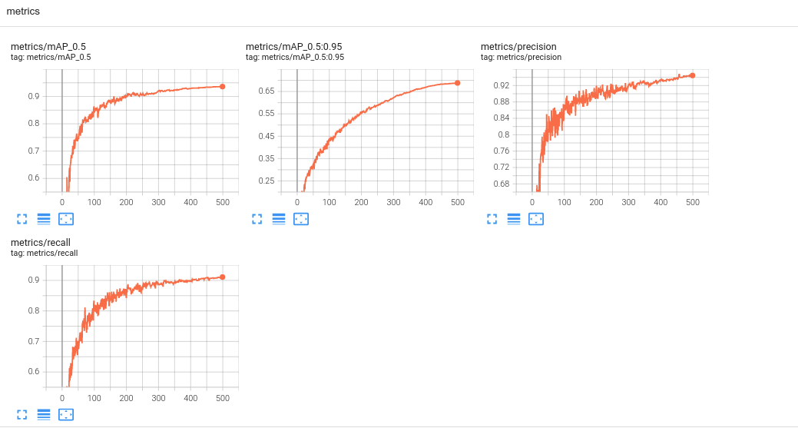
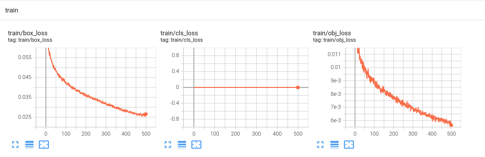
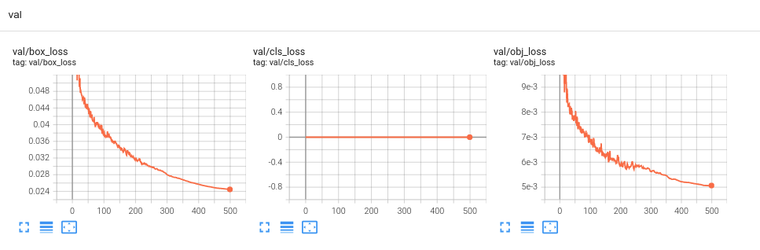
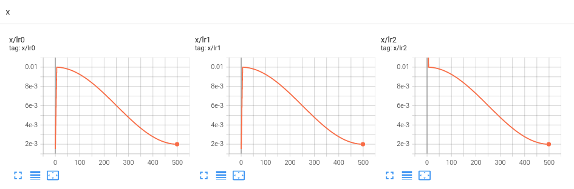

# Wildfire Detection

## Objectives

- To detect wildfires as early as possible and alert authorities / local communities.

## Experiments

### Dataset v1.0

- Dataset description: ~2400 images of widlfires collected from webcams (mostly western U.S.). Combination of dataset from AiforMankind, and images scavenged from aroudn the web.

- Labeling: The dataset was labelled only using one class (“Smoke”), in order to focus on smoke only. The smoke was labelled not only at its source (where it first occurs) but also in the air.

- Training: YOLOv5 was trained for 500 epochs.
Command:

```python
python train.py --img 640 --batch 16 --epochs 500 --data /content/drive/MyDrive/fireflyer/Detection\ system/datasets/v1.0/yolo_format/data.yaml --cache
```

- Testing: The dataset was tested on 3 smoke timelapse videos from YouTube (unlabelled) , and yielded satisfactory smoke detection results. Smoke was detected very soon after it appears recognizable to the human eye. However, testing on a video where clouds are present, clouds were mislabeled as smoke, mostly when they appeared closer to the landscape (where most of the labeling for smoke took place).

### Results

 
 
 
 


